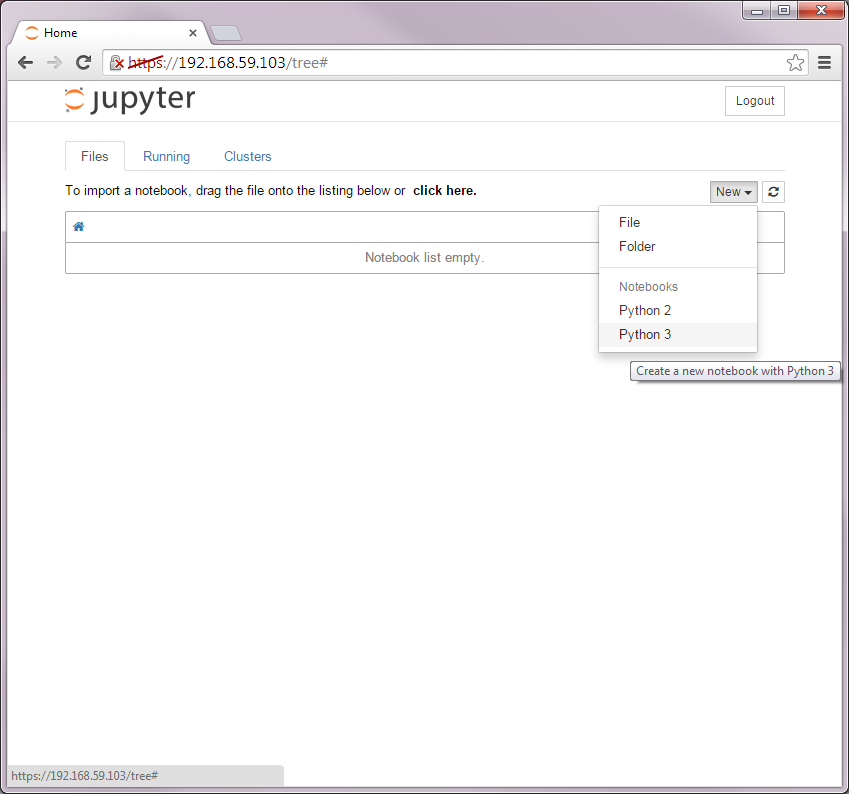
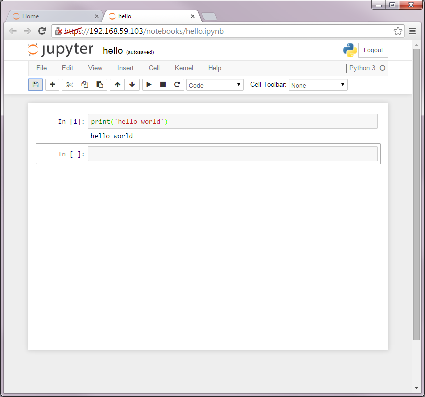
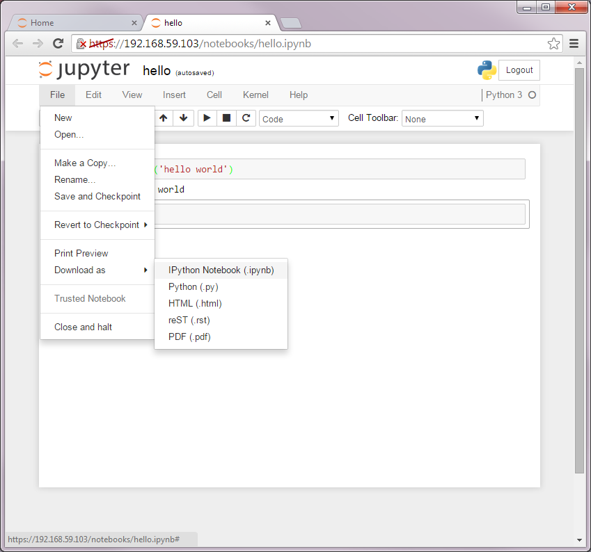

## Docker on Windows

### Installation

Refer to the [official Docker documentation](https://docs.docker.com/). For Windows, see [Docker for Windows installation guide](https://docs.docker.com/installation/windows/).

1. Download the latest release of the [Docker for Windows Installer](https://github.com/boot2docker/windows-installer/releases/latest).

2. Run the installer, which will install VirtualBox, MSYS-git, the boot2docker Linux ISO, and the Boot2Docker management tool.

3. Run the `Boot2Docker Start` shell script from your Desktop or Program Files > Boot2Docker for Windows. The Start script will ask you to enter an ssh key passphrase - the simplest (but least secure) is to just hit [Enter].


The Boot2Docker Start script will connect you to a shell session in the virtual machine. If needed, it will initialize a new Virtual Machine (VM) and start it.

### Running Docker

Boot2Docker will log you in automatically so you can start using Docker right
away.

You should go though the [10-minute Docker tutorial](https://www.docker.com/tryit/). It would also be a good idea to go through the [Docker User Guide](https://docs.docker.com/userguide/).

We will use the Docker container image `ipython/scipyserver` from the [IPython
Docker Hub repository](https://registry.hub.docker.com/u/ipython/scipyserver/). Run 

```console
$ docker pull ipython/scipyserver
```

This will download the container image. Let's make sure that it works:

```console
$ docker run ipython/scipyserver /bin/echo "hello world"
hello world
```

We can also launch the container image in an interactive mode:

```console
$ docker run -it ipython/scipyserver /bin/bash
root@0b2616b0e5a8:/# echo "hello world"
hello world
```

We will also be using IPython notebooks extensively in this course, so let's
make sure that the notebook server is working properly:

```console
$ docker run -d -p 443:8888 -e "PASSWORD=info490" ipython/scipyserver
```

Now open up a web browser of your choice and go to https://192.168.59.103
(if you see a security warning, ignore it and continue to the address). After you enter the password info490, you will be able to access the notebook server.



Select New > Python 3. An empty notebook will be created. You can test this by
entering 

```python
print('hello world')
```

and pressing <kbd>shift</kbd>+<kbd>Enter<kbd>:



When you are done working on your IPython notebook, save your work by selecting
File > Download as > IPython Notebook (.ipynb):



Your work will be saved on the *host* machine (not in the Docker container
image). To save your work in the container or move files between the image and
the host, see [Folder Sharing](docker_folder_sharing.md).
